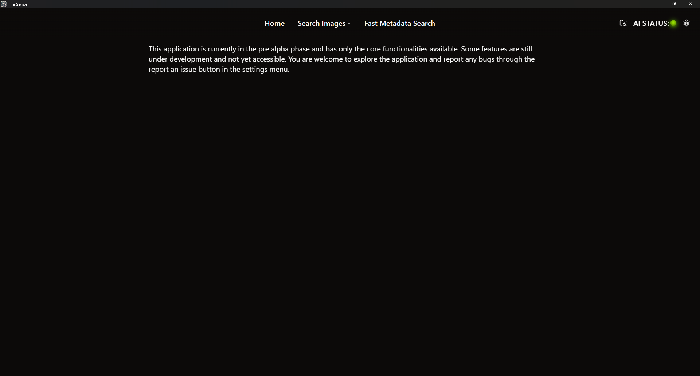
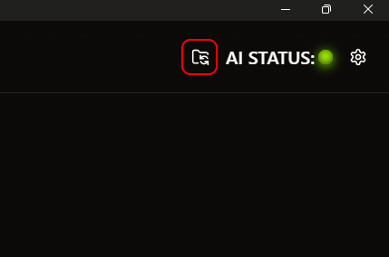
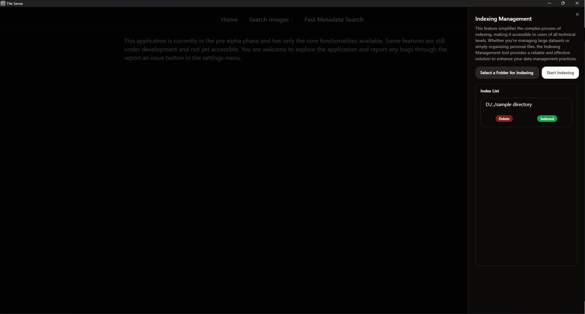
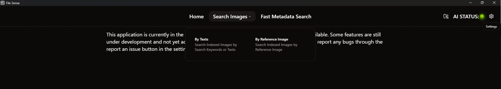
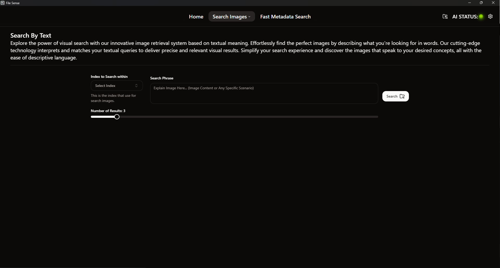
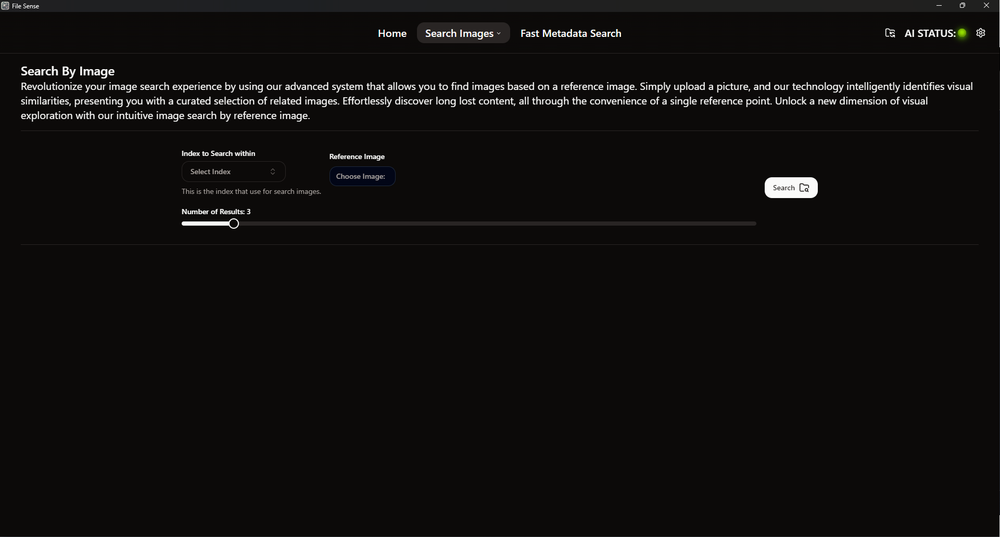
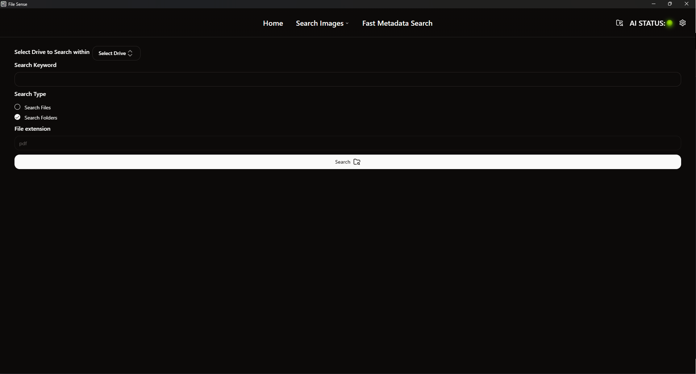
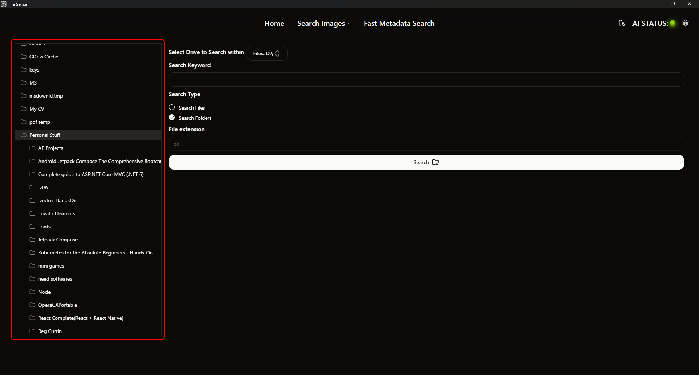

> File Sense is a tool for search images through Natural Language and semantic similarity. It is designed to be easy to use and to provide a simple interface for searching images and files.

### Start File Sense

Upon opening File Sense, you will see the home screen. This is where you can choose search images or files, Index Management as well as show the status of the AI engine.

:::note[Keep In Mind]
Upon launching File Sense, the AI engine will initiate, which may require some time to fully load. During this loading phase, the status of the AI engine can be monitored via the navigation bar, and you may notice that certain features are temporarily disabled. Once the AI engine has successfully loaded, the AI STATUS indicator will consistently illuminate in green. (Refer to the images provided below for further guidance.)

| AI STATUS | EXAMPLE |
| --------- | ----- |
| *ONLINE*    |       |
| *OFFLINE*   |       |

:::

Index Management is where you can manage the index of the directory as well as check the index status. You can add, delete, and update the index.

### Search Images

To search images, hover over the "Search Images" button on the navigation bar. This will reveal two options: "Search by Texts" and "Search by Reference Image".

:::note[Keep In Mind]
To Search Images `by Texts` or `by Reference Image`, There should be an index of the directory. If there is no index, you will not be able to search images. To Create an index of the directory by clicking on the "Index Management" button and then click on the "Select Directory for Indexing" button to choose directory for indexing and then click on the "Start Indexing" button to start indexing.
:::

#### Search by Texts

To search images by texts, click on the "Search by Texts" button. This will open a page where you can input the text you want to search for.

#### Search by Reference Image

To search images by reference image, click on the "Search by Reference Image" button. This will open a page where you can upload an image to search for similar images.

### Fast Metadata Search

To search files and directories, click on the "Fast Metadata Search" button on the navigation bar. This will open a page where you can input the text you want to search for. If user checks the search files, file extension should be provided.

:::tip[Tip]
If you want to search within a specific directory, you can select directory from the tree view.(Refer to the image provided below for further guidance.)

:::
